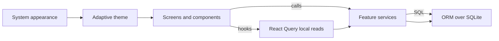
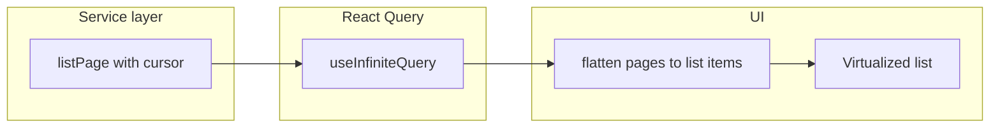

# Local-first finance app — merged roadmap

This document merges a phased product roadmap with cross-cutting engineering practices. It is **repository-agnostic**: adapt paths and tab names to your app.

---

## Guiding principles

- **Local-first**: user and business data live in SQLite; no remote API is required for core flows.
- **React Query** is for reading and caching the local database (and invalidation after writes), not for generic remote fetching unless you add sync later.
- **Business logic** belongs in each feature’s `services/` layer (and `utils.ts` for pure helpers), not in presentational components.
- **Money** is stored and passed as **integer cents** end-to-end; display goes through a single shared money component.
- **Styling** uses one system consistently (e.g. token-based themes with adaptive light/dark following the OS).
- **UI state** always considers loading, empty, and error.

---

## Architecture (high level)

---

## Suggested repository layout

| Area                                   | Role                                                               |
| -------------------------------------- | ------------------------------------------------------------------ |
| Router routes (e.g. file-based `app/`) | Tab and modal routes; thin screen composition                      |
| `src/db/`                              | DB client, schema, migrations, seed                                |
| `src/theme/`                           | Tokens, theme configuration, type augmentation                     |
| `src/components/`                      | Shared presentational and navigation building blocks               |
| `src/features/<feature>/`              | `services/`, optional `utils.ts`, `components/`, optional `hooks/` |
| Project conventions doc                | Rules agreed by the team (e.g. money, lists, layering)             |

---

## Engineering conventions (apply from the start)

These complement “services only” and **avoid rework** when lists and screens grow.

1. **No nested component definitions in screen files**
   Extract reusable UI to `src/features/<feature>/components/<kebab-case>.tsx` or shared `src/components/ui/`. Small inline callbacks or fragments in the screen are fine; avoid declaring new `function`/`const` components in the same file as the screen.
2. **Bounded list data**
   Do not load unbounded tables in a single query for UI lists. Use **cursor-based pagination** in the service (`LIMIT` + stable `orderBy` + cursor), and `**useInfiniteQuery` in React Query; flatten pages in the screen or a small hook.
3. **Preview and dashboard queries**
   “Top N” previews (e.g. to-review, recent items) should use `**LIMIT` (and indexes where needed), not full-table scans.
4. **Optional reference implementation**
   If you compare against another codebase, treat it as a **UX or layout reference only**—your stack (router, theming, money type) stays authoritative.
5. **Dependencies**
   Virtualized lists (e.g. FlashList), bottom sheets, and chart libraries are **optional per feature**; document choices when adding packages and prefer additive DB migrations (`CREATE TABLE IF NOT EXISTS`, guarded `ALTER TABLE`).

---

## Phase 1 — Theme system

**Goal**: One token set for colors, spacing, typography, shadows; adaptive light/dark **without** a duplicate manual theme toggle if the design follows the OS.

**Typical tasks**

- Define light and dark theme objects and a shared `Theme` type.
- Configure the styling layer once at startup with **adaptive** themes so the active theme tracks device appearance.
- Root **status bar** style follows resolved color scheme, not ad-hoc strings from unrelated APIs.
- Tab bar and shared components use the same token access pattern (e.g. themed `StyleSheet` + hooks where needed).
- Avoid parallel theme context that fights the adaptive system unless product requires in-app theme override.

**Verification**

| Check            | Expected                                       |
| ---------------- | ---------------------------------------------- |
| Single configure | Theme/styling setup runs once at app entry     |
| Adaptive         | Light/dark follow system / documented behavior |
| Typed themes     | TypeScript knows theme shape                   |
| Status bar       | Bar style derived from resolved scheme         |

---

## Phase 2 — Navigation and shared UI

**Goal**: Primary navigation matches the product (e.g. multiple main tabs) and a **consistent** header or section pattern (e.g. pill or segment control for major areas).

**Typical tasks**

- Register all main routes in the tab navigator; keep the router as the source of truth for “where we are.”
- Reusable **section tabs** (or equivalent) component driven by active route and theme tokens.
- Shared primitives: **Card**, **SectionTitle**, **EmptyState**, **LoadingSkeleton**, **ErrorState** (or equivalent names), all theme-aware.

---

## Phase 3 — Database foundation

**Goal**: Schema, migrations, and seed that make every tab implementable without hacks.

**Typical tasks**

- DB client + ORM schema modules + migration runner.
- At minimum, tables that match your features—for example: accounts, transactions, categories, budgets, recurrings, savings goals, investments, cash-flow aggregates, settings (extend as needed).
- Model fields needed for the UI first; strong typing; foreign keys where relationships exist.
- **Deterministic seed** (fixed data or seeded PRNG) plus optional “seed if empty” bootstrap using a settings singleton row.

**Net worth / history (optional but common)**  
If the product shows balance or net-worth over time, add an explicit **history or snapshot** table (e.g. per-account or daily aggregates) rather than only static account rows—keeps chart data honest and testable.

---

## Phase 4 — Core features (transactions, dashboard, accounts)

### Transactions

- Grouped list (e.g. by day), search, category filters, multi-select and batch actions, edit and category flows.
- **Service**: `listTransactionsPage` (or similar) returning rows + **next cursor**; filters in SQL where possible.
- **Hook**: `useInfiniteQuery` with `queryKey` including search and filter inputs; `getNextPageParam` from cursor.
- **UI**: One virtualized list with a **discriminated union** of row types (section header vs transaction); `onEndReached` → `fetchNextPage`.
- Optional: **deferred** search input to reduce query churn while typing.

### Dashboard

- Hero metrics, to-review, upcoming recurring payments, budget summary—driven from transactions, budgets, recurrings, and snapshot tables as designed.
- Charts: pick a library that fits Expo/RN constraints; feed from seeded or computed data.
- Ensure preview lists use **bounded** queries.

### Accounts

- Net worth card and timeframe control; grouped sections (e.g. by account type).
- **Service** methods for grouped accounts and time series for charts.
- Extract **chart**, **section header**, **account row** into feature components; prefer virtualized list if sections can be large.

---

## Phase 5 — Recurrings, savings/goals, budgets

- **Recurrings**: grid or list, edit modal with timeline/occurrences, CRUD in services.
- **Savings goals**: header summary, active vs completed sections, progress UI.
- **Budgets / categories**: summary donut or bars, rebalance and category edit modals; persist through services.

---

## Phase 6 — Cash flow and investments

- **Cash flow**: net income and spend views, range selection, optional excluded-spend handling; details modal; data from snapshots and/or transactions.
- **Investments**: holdings list, optional sparklines, display/sort filter sheet; virtualize if holdings lists can grow.

---

## Phase 7 — Polish and performance

- Audit every screen for **loading / empty / error**.
- **FlashList** (or equivalent) for long lists; **memoize** heavy view models and row components.
- Keep DB access out of components; invalidate queries after mutations.
- Light modal transitions; avoid unnecessary re-renders on theme or filter changes.

---

## Cursor pagination pattern (transactions-style)

**Contract sketch**

- Order: stable sort (e.g. `date desc`, `id desc`).
- Page: `limit = pageSize + 1` to detect `hasNextPage`; return `nextCursor` or null.
- Filters: same cursor semantics with `WHERE` clauses applied in SQL.

---

## Expected milestones (flexible)

| Milestone        | Outcome                                                                 |
| ---------------- | ----------------------------------------------------------------------- |
| After Phase 3    | App boots into seeded data; schema supports all planned tabs.           |
| After Phase 4    | Main tabs usable on real local data: transactions, dashboard, accounts. |
| After Phases 5–6 | Remaining tabs and modals in scope are implemented.                     |
| After Phase 7    | Production-quality states and scrolling behavior.                       |

---

## Maintenance: tracking progress

Use a short internal table (in your repo or issue tracker) mapping **plan area → implemented vs partial vs not started**. Replace repo-specific filenames with your own as the codebase evolves. The roadmap itself should stay **stable**; the tracking table is **ephemeral**.

---

## Risks and notes

- **Migrations**: favor additive changes; avoid destructive drops without a migration and backup story.
- **New packages**: align with performance goals (lists, gestures, charts) and team approval policy.
- **Tests**: optional but valuable for pure `utils` and service cursor logic.
